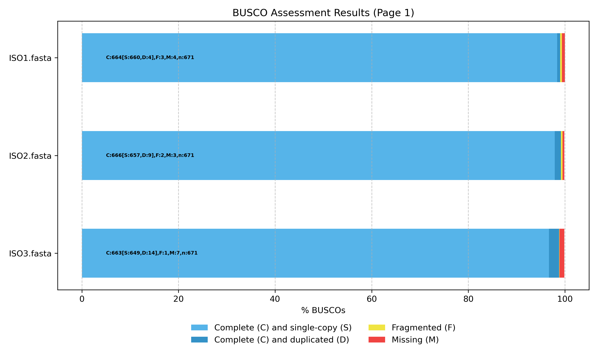
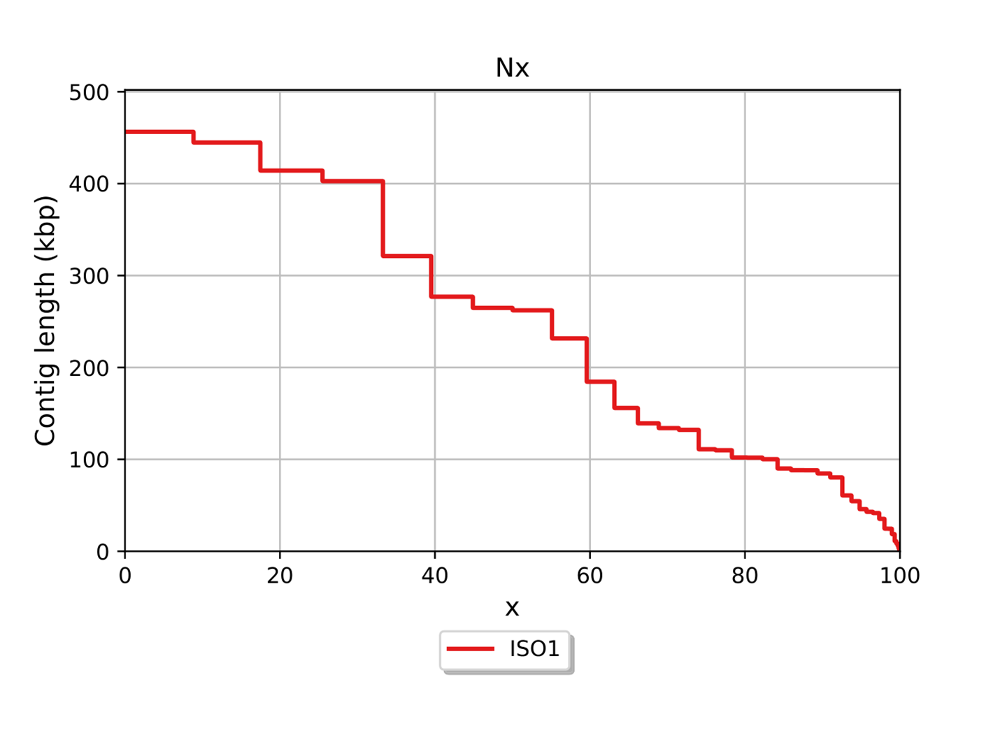
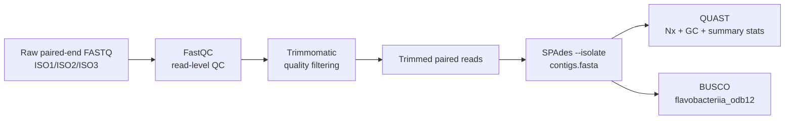

# Microbial Genome Assembly & QC (ISO1–ISO3)

De novo assembly and genome quality assessment for three bacterial isolates (ISO1–ISO3) sequenced from wastewater. This repository preserves **human-readable evidence artifacts** (QC/assembly reports + summaries) and a clear workflow narrative, while staying lightweight (no raw FASTQs or large intermediate outputs).

---

## 🧾 Overview

**What this is:** A complete, end-to-end microbial genome QC + assembly evaluation workflow (reads → draft genomes → quality/completeness assessment).

**Why it matters:** In microbial genomics, draft assemblies are only useful if the upstream read quality is acceptable and the assembly statistics suggest a coherent genome rather than fragmentation or mixed cultures. This project demonstrates how to assess that using standard bioinformatics tools.

**Data scale:** ~26 million paired-end reads across 3 isolates (~3–4 GB raw FASTQ). Reads were quality-filtered and trimmed with Trimmomatic prior to assembly.

**What I produced:**

* FastQC read-quality reports (R1/R2 for ISO1–ISO3)
* Trimming retention summary (paired-read survival)
* SPAdes assembly provenance (logs + input datasets per isolate)
* QUAST assembly quality reports (PDF/HTML per isolate)
* BUSCO completeness summaries and an aggregate plot

---

## 📊 Key results

### 🔍 Read-level summary (FastQC)

**Takeaway:** ISO1/ISO2 show similar GC (~33–34%), while ISO3 has markedly higher GC (~51–52%), an early signal that ISO3 may be compositionally and/or taxonomically distinct.

| Isolate | R1 total reads | R1 %GC | R2 total reads | R2 %GC | Read length |
| ------- | -------------- | ------ | -------------- | ------ | ----------- |
| ISO1    | 4,608,169      | 34%    | 4,608,169      | 34%    | 151 bp      |
| ISO2    | 8,781,530      | 33%    | 8,781,530      | 33%    | 151 bp      |
| ISO3    | 12,652,264     | 51%    | 12,652,264     | 52%    | 151 bp      |

### ✂️ Trimming (Trimmomatic)

**Takeaway:** Trimming preserved the vast majority of read pairs (≥97.8% survival), indicating minimal loss from filtering and retaining strong coverage for assembly.

| Sample | Start pairs | Surviving pairs | % survived |
| ------ | ----------- | --------------- | ---------- |
| ISO1   | 4,608,169   | 4,578,990       | 99.37%     |
| ISO2   | 8,781,530   | 8,648,449       | 98.48%     |
| ISO3   | 12,652,264  | 12,372,983      | 97.79%     |

### 🧩 Assembly summary (QUAST)

**What this shows:** Reference-agnostic draft assembly statistics. N50 is the contig length such that contigs of at least that length cover 50% of the assembly; L50 is the number of contigs needed to reach 50% of the assembly length.

**Takeaway:** ISO1/ISO2 assemble to ~5–6 Mb with ~33–35% GC and relatively low contig counts, consistent with coherent bacterial draft genomes. ISO3 is substantially larger (~12.1 Mb) with higher GC (48.7%) and more contigs, reinforcing that it is an outlier.

| Isolate | # Contigs | Largest contig (bp) | Total length (bp) | GC (%) | N50 (bp) | L50 |
| ------- | --------- | ------------------- | ----------------- | ------ | -------- | --- |
| ISO1    | 43        | 456,364             | 5,160,243         | 34.46  | 264,771  | 7   |
| ISO2    | 48        | 493,624             | 5,841,551         | 33.67  | 204,914  | 9   |
| ISO3    | 122       | 1,384,174           | 12,058,572        | 48.67  | 321,527  | 12  |

### ✅ BUSCO completeness

> Plot shown in the **Figures** section below.

**What this shows:** BUSCO searches each assembly for a set of conserved single‑copy orthologs (here: *flavobacteriia_odb12*, n=671). The stacked bars summarize the fraction of BUSCO genes that are **Complete** (single‑copy vs duplicated), **Fragmented**, or **Missing**.

**Takeaway:** All assemblies are highly complete against this lineage set; ISO3 shows the highest duplicated fraction (D), which can be informative when evaluating potential heterogeneity.

| Isolate | Lineage              | C (%) | S (%) | D (%) | F (%) | M (%) |
| ------- | -------------------- | ----- | ----- | ----- | ----- | ----- |
| ISO1    | flavobacteriia_odb12 | 99.0  | 98.4  | 0.6   | 0.4   | 0.6   |
| ISO2    | flavobacteriia_odb12 | 99.3  | 97.9  | 1.3   | 0.3   | 0.4   |
| ISO3    | flavobacteriia_odb12 | 98.8  | 96.7  | 2.1   | 0.1   | 1.0   |

### 🧠 Interpretation

* **ISO1 and ISO2** are consistent with **Flavobacteriia-like** genomes based on their ~5–6 Mb assembly sizes and ~33–35% GC content, paired with high contiguity.
* **ISO3** is a clear outlier (~12.1 Mb, ~48.7% GC, more contigs), consistent with a **non-Flavobacteriia organism and/or mixed culture/contamination** signal even if many conserved orthologs are still detected.

**Limitations:** Composition plots and duplicated BUSCOs can suggest heterogeneity, but confirming contamination/mixed culture would require explicit taxonomic classification (e.g., k-mer-based classifiers) and/or read-mapping/coverage inspection.

---

## 🖼️ Figures

> Selected plots (full reports in `results/`).

### BUSCO completeness



> **Figure 1.** BUSCO completeness profile for each assembly against conserved single-copy orthologs (flavobacteriia_odb12; n=671), split into Complete (single-copy vs duplicated), Fragmented, and Missing.

> **Conclusion from this plot:** All three assemblies are highly complete (~99% complete BUSCOs), consistent with near-complete recovery of core gene content. ISO1 (C:664; S:660; D:4; F:3; M:4) and ISO2 (C:666; S:657; D:9; F:2; M:3) show very few fragmented/missing BUSCOs. ISO3 remains highly complete (C:663) but has the highest duplicated (D:14) and missing (M:7) counts, which is consistent with greater assembly/biological complexity (e.g., duplicated regions, strain heterogeneity, or mixed sequence content) and aligns with ISO3’s outlier signals in QUAST (larger assembly size and distinct GC profile).


### Assembly contiguity (QUAST Nx)



> **Figure 2.** ISO1 Nx curve (reference-agnostic contiguity). Higher curves indicate more of the assembly captured in longer contigs.


> **Figure 3.** ISO3 Nx curve. Starts higher due to a very large contig, but drops across a longer tail, reflecting distribution across many contigs overall.

> **How to read Nx:** at each x-value (0–100%), y is the contig length such that contigs ≥ y cover x% of the assembly.

### GC content distribution (QUAST; contigs)


> **Figure 4.** GC% distribution across contigs for ISO3. A multi-modal distribution suggests heterogeneous sequence composition (e.g., mixed culture, plasmids, or horizontally acquired regions).

> **What stands out:** ISO3 shows a bimodal GC distribution (peaks ~35% and ~60%+), supporting that ISO3 is compositionally distinct from ISO1/ISO2.

---

## 📦 What this repo contains

This repo is intentionally **results/evidence-focused**:

* **FastQC HTML reports** for ISO1–ISO3 (R1/R2)
* **Trimmomatic summary** table of surviving read pairs
* **SPAdes per-isolate logs** + **input_dataset.yaml** files (compact, readable provenance)
* **QUAST PDF reports** per isolate (self-contained for GitHub viewing)
* **BUSCO short summaries** per isolate + a plot image

Raw sequencing data and heavy intermediate outputs are not included to keep the repository lightweight.

### 🔗 Quick links to evidence

* **Read QC:** `results/fastqc/ISO*/`
* **Trimming summary:** `results/trimmomatic/trimmed-table.txt`
* **Assembly provenance (SPAdes):** `results/spades/ISO*/spades.log` and `results/spades/ISO*/input_dataset.yaml`
* **Assembly QC (QUAST):** `results/quast/ISO*/ISO*_report.pdf` (primary) and `results/quast/ISO*/html/` (optional)
* **Completeness (BUSCO):** `results/busco/ISO*/short_summary.txt` and `assets/figures/busco_summary.png`

---


## 🎯 Scope

This project implements a standard microbial WGS workflow to produce draft assemblies and evaluate whether each isolate is consistent with a coherent single genome versus an outlier that may indicate a different taxon and/or mixed composition.

Scope highlights:

* Read QC (FastQC) to identify quality/adapters/GC anomalies before assembly
* Quality filtering / trimming (Trimmomatic) with high paired-read retention
* De novo assembly (SPAdes) with per-isolate provenance (logs + input datasets)
* Reference-agnostic assembly QC (QUAST): length, GC%, contiguity (N50/L50), and plots
* Biological completeness assessment (BUSCO) against conserved orthologs

---

## 🔄 Workflow



---

## 💡 Why each step exists

* **FastQC (read QC):** checks whether raw sequencing reads are usable (quality-by-cycle, GC distribution, adapter/overrepresented sequences) before investing compute in assembly.
* **Trimmomatic (trimming):** removes adapters and low-quality bases/reads so assembly is driven by higher-confidence sequence signal.
* **SPAdes (assembly):** reconstructs draft genomes (contigs) from paired-end reads using a de Bruijn graph assembler designed for microbial genomes.
* **QUAST (assembly evaluation, reference-agnostic):** summarizes contiguity and genome-level statistics (total length, GC%, contig counts, N50/L50) to evaluate draft assembly quality without requiring a reference genome.
* **BUSCO (biological completeness):** searches for conserved single-copy orthologs from a lineage dataset to estimate completeness and report single-copy vs duplicated hits.

---

## 🧪 Methods (step-by-step)

### 1) Read quality control (FastQC)

FastQC reports were generated for each isolate (R1/R2). Review focused on:

* per-base quality profiles (quality drop-off across cycles)
* GC distribution consistency
* adapter/overrepresented sequences
* basic sequence statistics (read counts, %GC)

### 2) Quality filtering (Trimmomatic)

Paired-end trimming was performed to remove low-quality bases/reads while retaining the majority of usable data. Practical emphasis was on preserving paired reads for assembly while eliminating clear low-quality segments.

* Paired-read retention is summarized in `results/trimmomatic/trimmed-table.txt` (≥97.8% surviving pairs across isolates).

### 3) De novo genome assembly (SPAdes)

Assemblies were generated per isolate using SPAdes in isolate-oriented mode.

Preserved provenance artifacts:

* `spades.log`: SPAdes version, run parameters, and progress output
* `input_dataset.yaml`: the exact paired-end read inputs and library layout consumed

Key settings captured from logs:

* isolate mode: `--isolate`
* multithreading: 8 threads
* read length-aware k-mer selection (for 151 bp reads): k = 21, 33, 55, 77
* assembly-only execution (no separate read error-correction stage)

### 4) Assembly QC (QUAST)

QUAST was used to compute standard draft-assembly metrics and visual summaries, including:

* total assembly length, GC%
* contig counts and largest contig
* N50/L50 (contiguity)
* Nx/GC plots (in the included reports)

Per-isolate QUAST PDFs are included for GitHub-friendly viewing; HTML reports are included optionally.

### 5) Completeness assessment (BUSCO)

BUSCO was run per assembly against a Flavobacteriia lineage dataset to estimate completeness:

* categories: Complete (single-copy / duplicated), Fragmented, Missing
* dataset: `flavobacteriia_odb12` (n = 671 BUSCOs)

Short summaries are included per isolate. Duplicated BUSCOs are reported as part of standard BUSCO output and can be informative when evaluating whether an assembly may reflect duplicated regions and/or mixed input.

---

## 🖥️ Compute environment and reproducibility

This analysis was executed in a Linux **scheduler-managed batch workflow** (cluster-submitted jobs on shared compute nodes; HTCondor). To make the pipeline portable and reproducible across compute nodes, I created isolated **Conda environments** for each major tool (FastQC, Trimmomatic, SPAdes, QUAST, BUSCO). In the original execution environment, these environments were packaged for reliable staging onto compute nodes.

Scheduler submit files and one-click re-run scripts are not retained; however, reproducibility is captured via:

* preserved QC/assembly evidence artifacts (FastQC/QUAST)
* SPAdes logs + input dataset YAMLs
* BUSCO short summaries (contain lineage dataset and tool configuration details)

---

## 🗂️ Repository structure

```text
.
├── README.md
├── LICENSE
├── assets/
│   └── figures/
│       ├── busco_figure.png
│       ├── quast_iso1_nx.png
│       ├── quast_iso3_nx.png
│       └── quast_iso3_gc_contigs.png
├── results/
│   ├── fastqc/
│   │   ├── ISO1/
│   │   │   ├── ISO1_L003_R1_001_fastqc.html
│   │   │   ├── ISO1_L003_R2_001_fastqc.html
│   │   ├── ISO2/
│   │   │   ├── ISO2_L003_R1_001_fastqc.html
│   │   │   ├── ISO2_L003_R2_001_fastqc.html
│   │   └── ISO3/
│   │       ├── ISO3_L003_R1_001_fastqc.html
│   │       ├── ISO3_L003_R2_001_fastqc.html
│   ├── trimmomatic/
│   │   └── trimmed-table.txt
│   ├── spades/
│   │   ├── ISO1/
│   │   │   ├── spades.log
│   │   │   └── input_dataset.yaml
│   │   ├── ISO2/
│   │   │   ├── spades.log
│   │   │   └── input_dataset.yaml
│   │   └── ISO3/
│   │       ├── spades.log
│   │       └── input_dataset.yaml
│   ├── quast/
│   │   ├── ISO1/
│   │   │   ├── ISO1_report.pdf
│   │   │   └── ISO1_report.html
│   │   ├── ISO2/
│   │   │   ├── ISO2_report.pdf
│   │   │   └── ISO2_report.html
│   │   └── ISO3/
│   │       ├── ISO3_report.pdf
│   │       └── ISO3_report.html
│   └── busco/
│       ├── ISO1/
│       │   └── short_summary.txt
│       ├── ISO2/
│       │   └── short_summary.txt
│       └── ISO3/
│           └── short_summary.txt
```

---

## 📝 Notes

* GitHub may not render `results/quast/ISO*/html/report.html` as an interactive page; the QUAST PDFs are the primary evidence artifacts for browsing in GitHub.
* FastQC HTML pages may reference companion folders when generated; if your FastQC output includes those folders, keep them alongside the HTMLs for full fidelity.

---

## 📜 License

This project is licensed under the **Apache License 2.0**. See [`LICENSE`](LICENSE).
